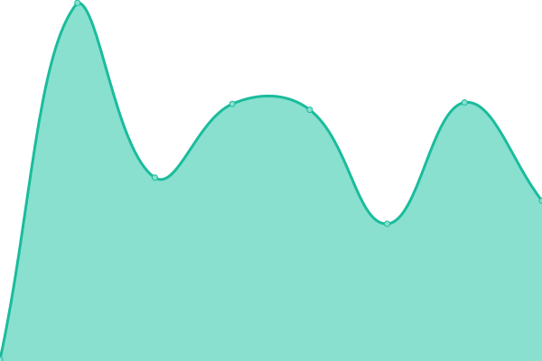
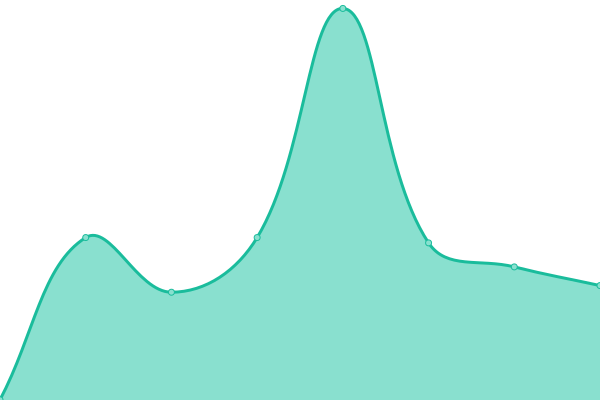
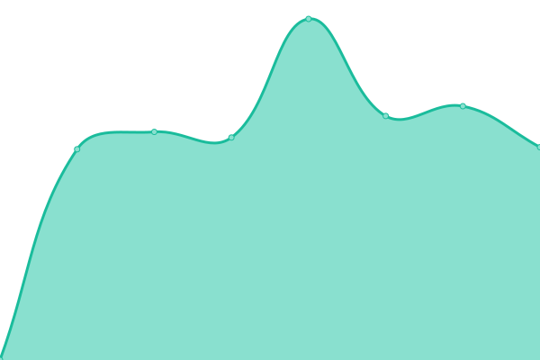
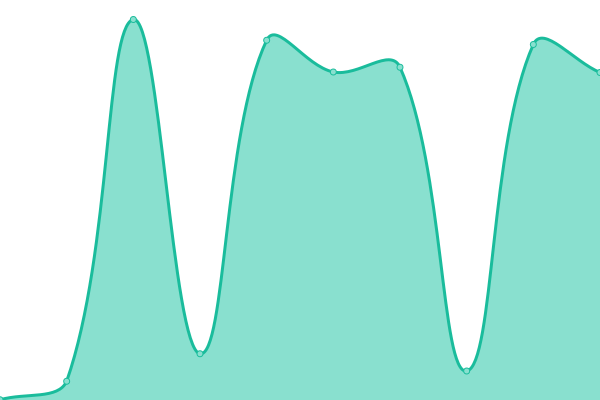
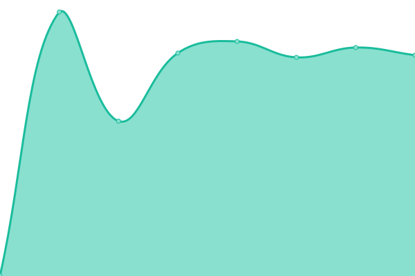
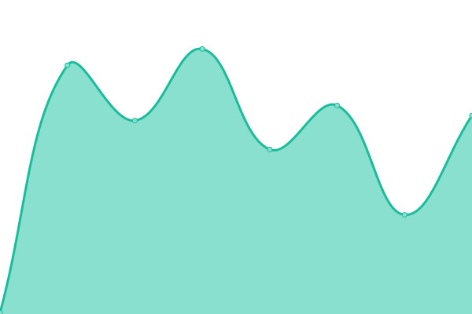
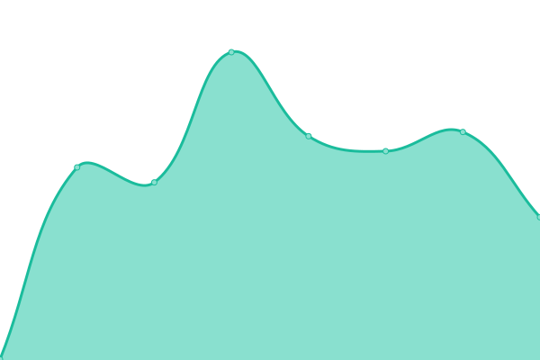
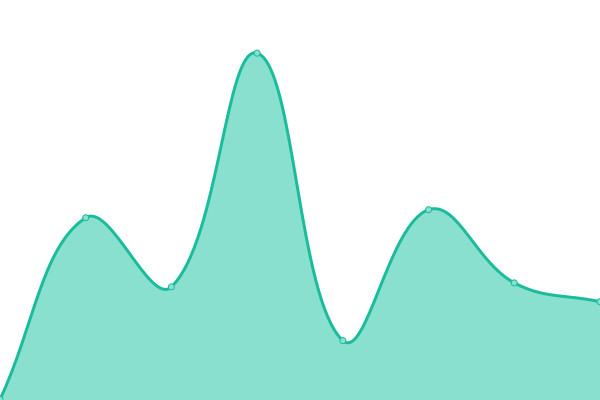

# [📈 Live Status](https://crs-digital.github.io/website-monitoring): <!--live status--> **🟩 All systems operational**

This repository contains the open-source uptime monitor and status page for [CRS Digital Team](https://crs-digital.github.io/website-monitoring), powered by [Upptime](https://github.com/upptime/upptime).

With [Upptime](https://upptime.js.org), you can get your own unlimited and free uptime monitor and status page, powered entirely by a GitHub repository. We use [Issues](https://github.com/crs-digital/website-monitoring/issues) as incident reports, [Actions](https://github.com/crs-digital/website-monitoring/actions) as uptime monitors, and [Pages](https://crs-digital.github.io/website-monitoring) for the status page.

<!--start: status pages-->
<!-- This summary is generated by Upptime (https://github.com/upptime/upptime) -->
<!-- Do not edit this manually, your changes will be overwritten -->
<!-- prettier-ignore -->
| URL | Status | History | Response Time | Uptime |
| --- | ------ | ------- | ------------- | ------ |
|  [CRS](https://www.crs.org) | 🟩 Up | [crs.yml](https://github.com/crs-digital/website-monitoring/commits/HEAD/history/crs.yml) | 

 215ms
     
 | 

<a href="https://crs-digital.github.io/website-monitoring/history/crs">100.00%</a>
    

|  [CRS Español](https://www.crsespanol.org) | 🟩 Up | [crs-espanol.yml](https://github.com/crs-digital/website-monitoring/commits/HEAD/history/crs-espanol.yml) | 

 286ms
     
 | 

<a href="https://crs-digital.github.io/website-monitoring/history/crs-espanol">100.00%</a>
    

|  [Support CRS](https://support.crs.org) | 🟩 Up | [support-crs.yml](https://github.com/crs-digital/website-monitoring/commits/HEAD/history/support-crs.yml) | 

 137ms
     
 | 

<a href="https://crs-digital.github.io/website-monitoring/history/support-crs">100.00%</a>
    

|  [CRS Rice Bowl](https://www.crsricebowl.org) | 🟩 Up | [crs-rice-bowl.yml](https://github.com/crs-digital/website-monitoring/commits/HEAD/history/crs-rice-bowl.yml) | 

 782ms
     
 | 

<a href="https://crs-digital.github.io/website-monitoring/history/crs-rice-bowl">100.00%</a>
    

|  [Annual Report](https://annualreport.crs.org) | 🟩 Up | [annual-report.yml](https://github.com/crs-digital/website-monitoring/commits/HEAD/history/annual-report.yml) | 

 151ms
     
 | 

<a href="https://crs-digital.github.io/website-monitoring/history/annual-report">100.00%</a>
    

|  [Changing the Way We Care](https://www.changingthewaywecare.org) | 🟩 Up | [changing-the-way-we-care.yml](https://github.com/crs-digital/website-monitoring/commits/HEAD/history/changing-the-way-we-care.yml) | 

 202ms
     
 | 

<a href="https://crs-digital.github.io/website-monitoring/history/changing-the-way-we-care">100.00%</a>
    

|  [Coffeelands](https://coffeelands.crs.org) | 🟩 Up | [coffeelands.yml](https://github.com/crs-digital/website-monitoring/commits/HEAD/history/coffeelands.yml) | 

 141ms
     
 | 

<a href="https://crs-digital.github.io/website-monitoring/history/coffeelands">100.00%</a>
    

|  [Compass](https://compass.crs.org) | 🟩 Up | [compass.yml](https://github.com/crs-digital/website-monitoring/commits/HEAD/history/compass.yml) | 

 573ms
     
 | 

<a href="https://crs-digital.github.io/website-monitoring/history/compass">100.00%</a>
    

|  [CRS Materials](https://crsmaterials.crs.org) | 🟩 Up | [crs-materials.yml](https://github.com/crs-digital/website-monitoring/commits/HEAD/history/crs-materials.yml) | 

 691ms
     
 | 

<a href="https://crs-digital.github.io/website-monitoring/history/crs-materials">100.00%</a>
    

|  [Farmer to Farmer](https://farmertofarmer.crs.org) | 🟩 Up | [farmer-to-farmer.yml](https://github.com/crs-digital/website-monitoring/commits/HEAD/history/farmer-to-farmer.yml) | 

 157ms
     
 | 

<a href="https://crs-digital.github.io/website-monitoring/history/farmer-to-farmer">100.00%</a>
    

|  [Gift Catalog](https://gifts.crs.org) | 🟩 Up | [gift-catalog.yml](https://github.com/crs-digital/website-monitoring/commits/HEAD/history/gift-catalog.yml) | 

 410ms
     
 | 

<a href="https://crs-digital.github.io/website-monitoring/history/gift-catalog">100.00%</a>
    

|  [ICS](https://ics.crs.org) | 🟩 Up | [ics.yml](https://github.com/crs-digital/website-monitoring/commits/HEAD/history/ics.yml) | 

 132ms
     
 | 

<a href="https://crs-digital.github.io/website-monitoring/history/ics">100.00%</a>
    

|  [ICT4D Conference](https://www.ict4dconference.org) | 🟩 Up | [ict-4-d-conference.yml](https://github.com/crs-digital/website-monitoring/commits/HEAD/history/ict-4-d-conference.yml) | 

 195ms
     
 | 

<a href="https://crs-digital.github.io/website-monitoring/history/ict-4-d-conference">100.00%</a>
    

|  [Impact / 75th Anniversary](https://impact.crs.org) | 🟩 Up | [impact-75th-anniversary.yml](https://github.com/crs-digital/website-monitoring/commits/HEAD/history/impact-75th-anniversary.yml) | 

 787ms
     
 | 

<a href="https://crs-digital.github.io/website-monitoring/history/impact-75th-anniversary">100.00%</a>
    

|  [Onboarding](https://onboarding.crs.org) | 🟩 Up | [onboarding.yml](https://github.com/crs-digital/website-monitoring/commits/HEAD/history/onboarding.yml) | 

 225ms
     
 | 

<a href="https://crs-digital.github.io/website-monitoring/history/onboarding">100.00%</a>
    

|  [OVC Support](https://ovcsupport.org) | 🟩 Up | [ovc-support.yml](https://github.com/crs-digital/website-monitoring/commits/HEAD/history/ovc-support.yml) | 

 930ms
     
 | 

<a href="https://crs-digital.github.io/website-monitoring/history/ovc-support">100.00%</a>
    

|  [Vatican Conference](https://www.viiconference.org) | 🟩 Up | [vatican-conference.yml](https://github.com/crs-digital/website-monitoring/commits/HEAD/history/vatican-conference.yml) | 

 220ms
     
 | 

<a href="https://crs-digital.github.io/website-monitoring/history/vatican-conference">100.00%</a>
    

|  [Virtual Votive](https://prayers.crs.org) | 🟩 Up | [virtual-votive.yml](https://github.com/crs-digital/website-monitoring/commits/HEAD/history/virtual-votive.yml) | 

 703ms
     
 | 

<a href="https://crs-digital.github.io/website-monitoring/history/virtual-votive">100.00%</a>
    

|  [SofTrek API](https://webapps.softrek.com/crsprod/api/proc) | 🟩 Up | [sof-trek-api.yml](https://github.com/crs-digital/website-monitoring/commits/HEAD/history/sof-trek-api.yml) | 

 246ms
     
 | 

<a href="https://crs-digital.github.io/website-monitoring/history/sof-trek-api">100.00%</a>
    

<!--end: status pages-->

[**Visit our status website →**](https://crs-digital.github.io/website-monitoring)

## 📄 License

- Powered by: [Upptime](https://github.com/upptime/upptime)
- Code: [MIT](./LICENSE) © [Anand Chowdhary](https://anandchowdhary.com), supported by [Pabio](https://pabio.com)
- Data in the `./history` directory: [Open Database License](https://opendatacommons.org/licenses/odbl/1-0/)
